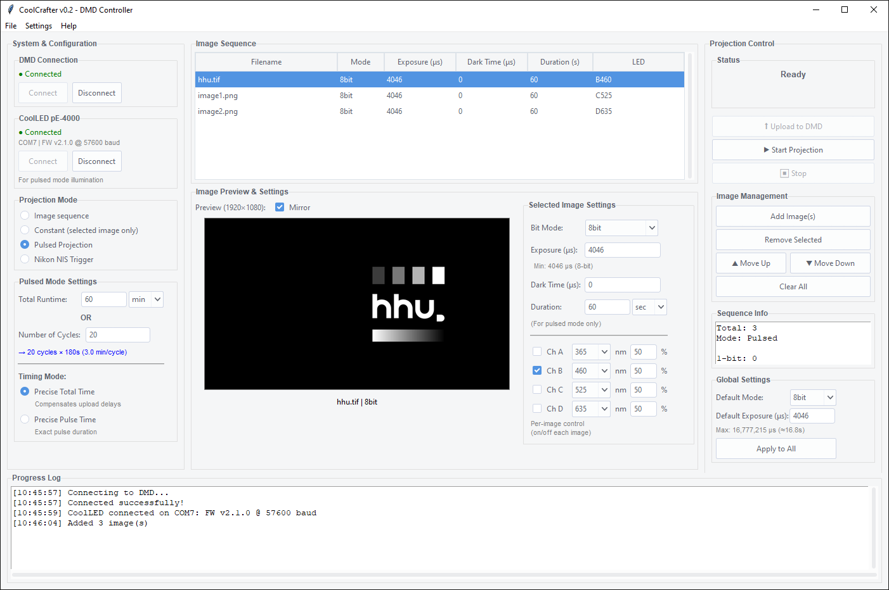

# Pycrafter6500-8bit - Python Controller for TI DLP LightCrafter 6500

Python controller for Texas Instruments' DLPLCR6500EVM with 8-bit grayscale support. Controls pattern on-the-fly mode with binary and grayscale image sequences. Compatible with [uPatternScope](https://doi.org/10.1038/s41467-024-54351-6) for optogenetic microscopy.

## About This Fork

Fork of [Pycrafter6500](https://github.com/csi-dcsc/Pycrafter6500) with added 8-bit grayscale support, developed using reference code from [uPatternScope](https://github.com/santkumar/uPatternScope).

## Features

- **1-bit and 8-bit Image Projection**: Binary patterns and 256-level grayscale
- **Pattern On-The-Fly Mode**: Upload and display image sequences via USB
- **Flexible Timing Control**: Independent exposure times, dark times, and triggers
- **Fast Image Encoding**: Enhanced Run-Length Encoding (ERLE) for efficient data transfer
- **Multiple Example Scripts**: Ready-to-use examples for various use cases
- **Cross-Platform**: Compatible with Windows, macOS, and Linux

## Requirements

- **Python**: 2.x or 3.x (tested up to 3.8)
- **Dependencies**:
  - `pyusb` - USB communication
  - `numpy` - Array operations
  - `PIL/pillow` - Image loading and processing
  - `ttkthemes` - For the gui

### Driver Installation

**Windows Users**: Install USB drivers using [Zadig](http://zadig.akeo.ie/)
- Select the DLP LightCrafter 6500 device
- Choose `WinUSB` driver (recommended for modern systems)
- If you encounter issues, try `libusbK` or `libusb-win32` as fallbacks
- Click "Install Driver"

**Linux/macOS**: libusb should work out of the box

## Installation

```bash
# Install dependencies
pip install pyusb numpy pillow opencv-python ttkthemes
```

## Graphical User Interface

Modern GUI for DMD control without coding. Launch with `python gui.py`.



**Features:**
- **Three projection modes**: Sequence (24×1-bit), Constant (single image), Pulsed (timed alternation)
- **Image management**: Multi-select, reordering (Move Up/Down or Ctrl+Up/Down), live preview with mirror option
- **Flexible timing**: Per-image exposure/dark time/duration with bidirectional calculations
- **Demo mode**: Test without hardware

## Quick Start

### Basic Connection

```python
import pycrafter6500

# Connect to DMD
dlp = pycrafter6500.dmd()

# Set to pattern on-the-fly mode
dlp.changemode(3)
```

### Project a 1-bit Binary Image

```python
import numpy as np
from PIL import Image

# Load and convert image to binary
img = Image.open("image.png").convert('L').resize((1920, 1080))
img_array = np.array(img) // 129  # Convert to 0 or 1

# Define sequence
images = [img_array]
exposure = [4046]  # microseconds
trigger_in = [False]
dark_time = [0]
trigger_out = [1]

dlp.defsequence(images, exposure, trigger_in, dark_time, trigger_out, 0)
dlp.startsequence()
```

### Project an 8-bit Grayscale Image

```python
import numpy as np
from PIL import Image

# Load 8-bit grayscale image
img = Image.open("photo.tif").convert('L').resize((1920, 1080))
img_array = np.array(img, dtype=np.uint8)  # Keep 0-255 values

# Define 8-bit sequence
images = [img_array]
exposure = [4046]  # microseconds
trigger_in = [False]
dark_time = [0]
trigger_out = [1]

dlp.defsequence_8bit(images, exposure, trigger_in, dark_time, trigger_out, 0)
dlp.startsequence()
```

## API Reference

### Core Methods

```python
dlp = pycrafter6500.dmd()                          # Initialize connection
dlp.changemode(3)                                   # Set to pattern on-the-fly mode

# 1-bit: Up to 24 images
dlp.defsequence(images, exposure, trigger_in, dark_time, trigger_out, repetitions)

# 8-bit: 1 image at a time
dlp.defsequence_8bit(images, exposure, trigger_in, dark_time, trigger_out, repetitions)

# Control
dlp.startsequence() / dlp.pausesequence() / dlp.stopsequence()
dlp.idle_on() / dlp.idle_off() / dlp.standby() / dlp.wakeup() / dlp.reset()
```

**Parameters:**
- `images`: List of numpy arrays (1920×1080, uint8). Values: 0-1 (1-bit) or 0-255 (8-bit)
- `exposure`: List of exposure times in microseconds
- `trigger_in/out`: External trigger configuration
- `dark_time`: Dark periods between patterns (μs)
- `repetitions`: Repeat count (0 = infinite)

## Folder Structure

```
Pycrafter6500-8bit/
├── gui.py                          # GUI application
├── pycrafter6500.py               # Core DMD library
├── erle.py                        # Image encoding (ERLE)
├── generate_image_sequence.py     # Generate 24-frame test sequence
├── examples/
│   ├── constant_projection.py     # Single image projection
│   └── pulsed_projection.py       # Timed alternating projection
├── images/
│   └── sequence/                  # Generated test patterns (24 frames)
└── doc/
    └── screen.png                 # GUI screenshot
```

## Example Scripts

### `constant_projection.py`
Continuously project a single 8-bit grayscale image.
```bash
python examples/constant_projection.py
```

### `pulsed_projection.py`
Alternate between two images with configurable timing. Edit script to configure durations and modes (1-bit or 8-bit).
```bash
python examples/pulsed_projection.py
```

### `generate_image_sequence.py`
Generate 24-frame test sequence for Sequence Mode. Creates rotating patterns spanning full screen.
```bash
python generate_image_sequence.py
```

## 8-bit Grayscale: How It Works

8-bit grayscale uses **Binary Pulse Width Modulation (PWM)**:
1. Image decomposed into 8 binary bit planes
2. Each plane displayed with weighted exposure (1×, 2×, 4×, ... 128×)
3. Eye integrates rapid flashes to perceive 256 gray levels

| Feature | 1-bit | 8-bit |
|---------|-------|-------|
| **Levels** | 2 (black/white) | 256 |
| **Values** | 0-1 | 0-255 |
| **Exposure** | ~4ms | ~100ms |
| **Batch** | Up to 24 images | 1 image |

## Image Requirements

- **Resolution**: 1920×1080 (auto-resized)
- **Format**: PNG, JPEG, TIFF, BMP (PIL-supported)
- **Data**: numpy.uint8 arrays (0-1 for 1-bit, 0-255 for 8-bit)

## Troubleshooting

- **DMD not detected**: Check USB connection and drivers (Windows: use Zadig)
- **Image brightness**: Adjust exposure time (μs) or conversion threshold
- **8-bit batch error**: Use list with 1 image: `images = [img_array]`
- **Artifacts**: Verify 1920×1080 resolution and correct value range

## Technical Details

- **USB**: HID protocol (VID: 0x0451, PID: 0xc900)
- **Encoding**: Enhanced Run-Length Encoding (ERLE) per DLPC900 spec
- **Modified files**: `pycrafter6500.py` (8-bit support), `erle.py` (merge_8bit/encode_8bit)

## Credits

- **Original**: [Pycrafter6500](https://github.com/csi-dcsc/Pycrafter6500) | [DOI: 10.1364/OE.25.000949](https://doi.org/10.1364/OE.25.000949)
- **8-bit reference**: [uPatternScope](https://github.com/santkumar/uPatternScope) | [DOI: 10.1038/s41467-024-54351-6](https://doi.org/10.1038/s41467-024-54351-6)
- **Contributors**: Guangyuan Zhao (Python 3.x), Ashu (@e841018) - [ERLE encoder](https://github.com/e841018/ERLE)
- **Documentation**: [DLPC900 Programmer's Guide](http://www.ti.com/lit/ug/dlpu018b/dlpu018b.pdf)

## License

See `license.txt`

---

**Version**: 1.1 (8-bit grayscale support) | October 2025
