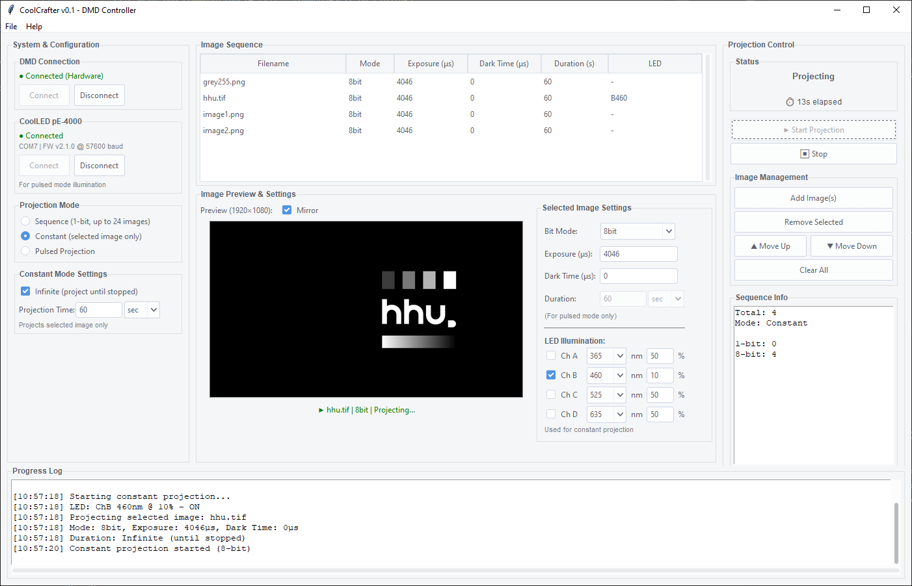

# CoolCrafter - Synchronized DMD & LED Control for Optogenetics

**Designed for [uPatternScope](https://github.com/santkumar/uPatternScope)** - an optogenetic microscopy platform for spatiotemporal illumination control.

Integrated control system for the **TI DLP LightCrafter 6500** (DMD) and **CoolLED pE-4000** (LED illumination). Provides synchronized projection and LED control for optogenetic experiments with precise spatial and temporal control. Implemented with Claude Sonnet 4.5.

**Built on:**
- [Pycrafter6500](https://github.com/csi-dcsc/Pycrafter6500) - DMD control foundation
- [uPatternScope](https://github.com/santkumar/uPatternScope) - 8-bit grayscale support and optogenetic workflows
- [CoolLED_control](https://github.com/philglock/CoolLED_control) - LED integration

## Applications

Three GUI applications for different use cases:

### **CoolCrafter_gui.py** (Main Application)
**Synchronized DMD + LED control** for integrated optogenetic experiments.
- Controls both DMD projection and LED illumination simultaneously
- Per-image LED wavelength and intensity settings (4 independent channels)
- Three projection modes: Sequence, Constant, Pulsed
- Real-time projection timer with progress tracking
- **Use this for synchronized optogenetic stimulation**

### **Pycrafter6500_gui.py** (DMD Standalone)
**DMD-only control** for pattern projection without LED synchronization.
- 1-bit and 8-bit grayscale image projection
- Pattern-on-the-fly mode with up to 24 images (1-bit) or 1 image (8-bit)
- Fine-grained exposure and dark time control
- **Use this for pure DMD projection tasks**

### 💡 **CoolLED_gui.py** (LED Standalone)
**CoolLED pE-4000 control** for LED illumination without DMD.
- Independent 4-channel control (A, B, C, D)
- Wavelength selection per channel:
  - Channel A: UV range (365-435nm)
  - Channel B: Blue range (460-500nm)
  - Channel C: Green/Yellow range (525-595nm)
  - Channel D: Red/NIR range (635-770nm)
- Real-time intensity adjustment (0-100%) per channel
- Built-in function generator for dynamic illumination patterns
- Live connection status and device info
- Auto-detection of serial port and baud rate
- **Use this for testing LED modules, calibrating intensities, or standalone illumination experiments**

## Screenshot



*CoolCrafter main interface showing synchronized DMD and LED control with image preview, per-image LED settings, and real-time projection status.*

## Quick Start

### Installation

```bash
# Install dependencies
pip install pyusb pyserial numpy pillow ttkthemes
```

**Windows USB Drivers (DMD)**: Install using [Zadig](http://zadig.akeo.ie/)
- Options → List All Devices → Select DLPC900
- Choose `libusbK` or `libusb-win32` driver → Install

**CoolLED pE Driver**: Required for CoolLED pE-4000 control
- Download: [CoolLED pE Driver](https://www.coolled.com/support/imaging-software/#coolled-pe-driver)


### Launch Applications

**Launcher (Recommended):**
```bash
python launcher.py
```
A simple menu will appear allowing you to choose which application to start.

**Direct Launch:**
```bash
# Main synchronized app (DMD + LED)
python CoolCrafter_gui.py

# DMD only
python Pycrafter6500_gui.py

# LED only
python CoolLED_gui.py
```

**Windows Users**: Double-click `launch_gui.bat` or `launch_gui.vbs` to start the launcher. See [WINDOWS_SETUP.md](WINDOWS_SETUP.md) for creating desktop shortcuts and taskbar pinning.

## Key Features

**DMD Control:**
- 1-bit (binary) and 8-bit (256-level grayscale) projection
- Pattern-on-the-fly mode: up to 24×1-bit or 1×8-bit images
- Flexible timing: per-image exposure, dark time, duration
- Three projection modes: Sequence, Constant, Pulsed

**CoolLED Integration:**
- 4 independent channels (A, B, C, D)
- Wavelength selection: UV (365-435nm), Blue (460-500nm), Green/Yellow (525-595nm), Red/NIR (635-770nm)
- Per-channel intensity control (0-100%)
- Synchronized with DMD projection timing


## Example Scripts

Ready-to-use Python scripts for common projection tasks:

### **`examples/constant_projection.py`**
Continuously project a single 8-bit grayscale image.

### **`examples/pulsed_projection.py`**
Alternate between two images with configurable timing.

**For GUI users**: Use **CoolCrafter_gui.py** for interactive control with LED synchronization!

## Project Structure

```
CoolCrafter/
├── CoolCrafter_gui.py             # Main app (DMD + LED)
├── Pycrafter6500_gui.py           # DMD standalone
├── CoolLED_gui.py                 # LED standalone
├── pycrafter6500.py               # DMD controller library
├── erle.py                        # Image encoding (ERLE)
├── examples/
│   ├── constant_projection.py     # Single image projection
│   └── pulsed_projection.py       # Timed alternating projection
└── images/                        # Test images
```

## Technical Notes

**8-bit Grayscale**: Uses Binary PWM - image decomposed into 8 bit planes, each displayed with weighted exposure (1×, 2×, 4×, ... 128×). 

**Image Requirements**: 1920×1080 (auto-resized), PNG/JPEG/TIFF/BMP, numpy arrays with 0-1 (1-bit) or 0-255 (8-bit)

**Limitations**: 
- 1-bit mode: up to 24 images; 8-bit mode: 1 image at a time
- **Sequence/Constant modes**: Hardware exposure limited to ~3-5 seconds (hardware-dependent)
- **Pulsed mode**: No exposure limit - uses software-controlled duration for any length

**Tip**: For projections longer than a few seconds, use Pulsed mode with the duration parameter!

## Hardware Testing

Test your hardware's maximum exposure time (relevant for Sequence/Constant modes):

```bash
python determine_max_exposure.py
```

**See [HARDWARE_TESTING.md](HARDWARE_TESTING.md) for detailed testing instructions, troubleshooting, and configuration examples.**


## Credits

Based on [Pycrafter6500](https://github.com/csi-dcsc/Pycrafter6500) with 8-bit support from [uPatternScope](https://github.com/santkumar/uPatternScope). CoolLED integration based on [CoolLED_control](https://github.com/philglock/CoolLED_control). Uses [ERLE encoding](https://github.com/e841018/ERLE) for image compression.

**References:**
- uPatternScope: [DOI: 10.1038/s41467-024-54351-6](https://doi.org/10.1038/s41467-024-54351-6)
- Original Pycrafter: [DOI: 10.1364/OE.25.000949](https://doi.org/10.1364/OE.25.000949)
- CoolLED Control: [philglock/CoolLED_control](https://github.com/philglock/CoolLED_control)
- TI DLPC900: [Programmer's Guide](http://www.ti.com/lit/ug/dlpu018b/dlpu018b.pdf)

---

**License**: See `license.txt` | **Version**: 2.0 (CoolCrafter) | January 2025
